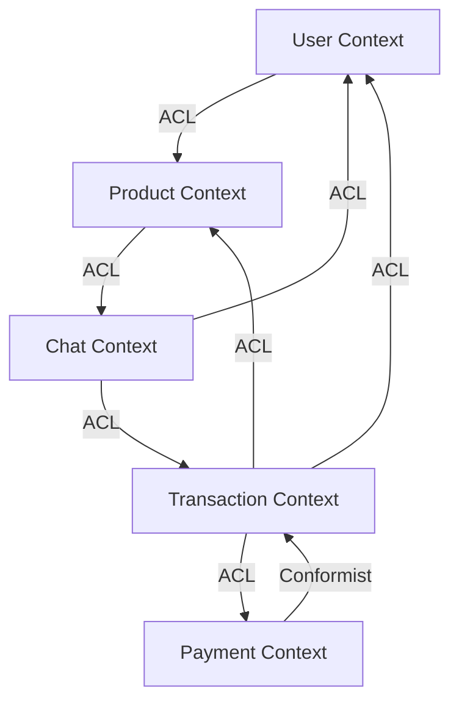

# Bounded Context 관계도

## Context Map

## Context 관계 설명

### User Context
- **역할**: 사용자 관리, 신뢰도 점수
- **관계**: 다른 모든 컨텍스트에서 참조하는 핵심 컨텍스트

### Product Context
- **역할**: 상품 관리, 카테고리, 검색
- **관계**: User Context의 사용자 정보를 ACL을 통해 참조

### Chat Context
- **역할**: 실시간 채팅, 가격 제안
- **관계**: User, Product Context 정보를 필요로 함

### Transaction Context
- **역할**: 거래 관리, 배송 정보
- **관계**: User, Product, Payment Context와 연동

### Payment Context
- **역할**: 결제 처리
- **관계**: Transaction Context에 종속적 (Conformist)

## 통합 패턴

- **ACL (Anti-Corruption Layer)**: 외부 컨텍스트의 변경으로부터 보호
- **Conformist**: Payment가 Transaction의 모델을 따름
- **Event-Driven**: 도메인 이벤트를 통한 느슨한 결합